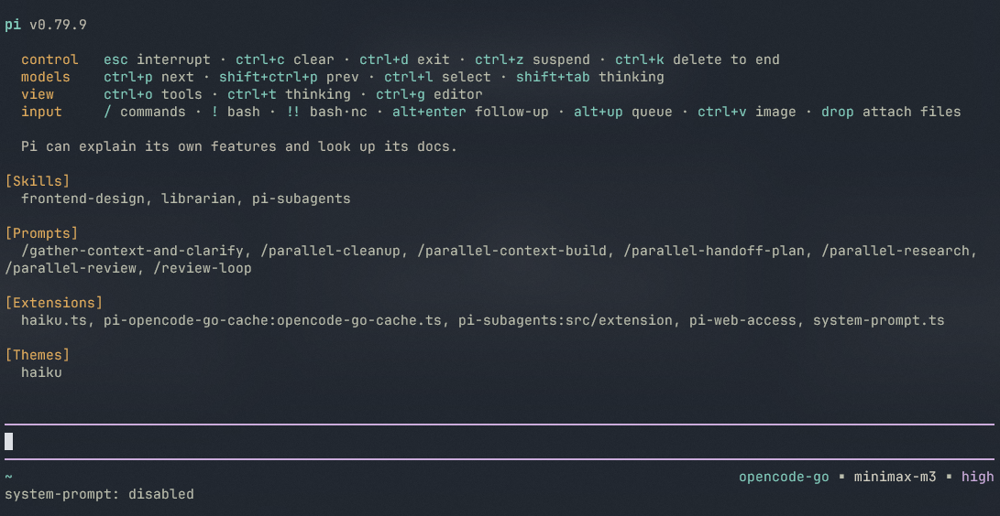
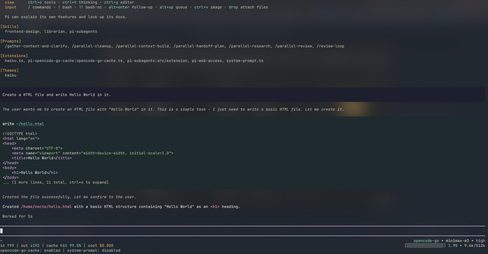

<p align="center">
  
  
</p>

# pi-haiku

A warm theme and a tidier header and footer for [pi](https://pi.dev).

## What's in it

- **A calm dark theme** — soft teal accent, deep blue-violet background, easy on the eyes during long sessions.
- **A header at the top of the screen** with the most-used shortcuts, grouped by what they do, so you can find them at a glance.
- **A footer that quietly shows the useful stuff** — where you are, which model is thinking, how long it's been thinking, how full the conversation is, and how much it has cost so far.
- **A live timer** that counts up while pi is working, and reports the total when it's done.
- **A fresh start** — the visible screen is cleared when you launch pi, so you always begin on a clean page. Your scrollback is kept, so the mouse wheel still works.

Everything is on by default when you install it.

## Install

```bash
pi install npm:pi-haiku
```

## Toggle

Type `/haiku` to turn the header and footer on or off. The theme stays as you set it.

## License

MIT
